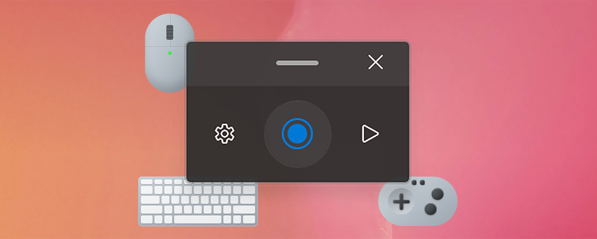

# Redo

## About
Redo is a tool which help you to record mouse click and automate the activity by repeating it!

## Installing and running Redo

### Requirements

- Windows 11 or Windows 10 version 2004 (code name 20H1 / build number 19041) or newer.
- x64 processor

### Via GitHub with EXE [Recommended]

Go to the [Redo GitHub releases page][github-release-link] and click on `Assets` at the bottom to show the files available in the release.